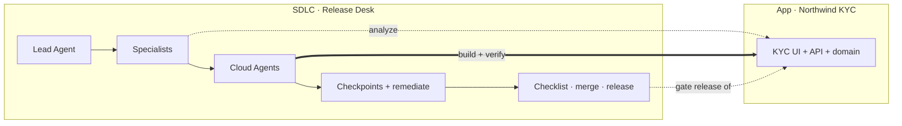

# Release Desk — Architecture (Mermaid)

Last updated: 2026-11-17 (Asia/Calcutta)

Two lanes: **SDLC** builds and verifies **KYC**.

```mermaid
flowchart LR
  subgraph SDLC["SDLC · Release Desk"]
    Lead["Lead Agent"]
    Spec["Specialists"]
    Cloud["Cloud Agents"]
    Verify["Checkpoints + remediate"]
    Human["Checklist · merge · release"]
  end

  subgraph APP["App · Northwind KYC"]
    KYC["KYC UI + API + domain"]
  end

  Lead --> Spec --> Cloud --> Verify --> Human
  Spec -.->|analyze| KYC
  Cloud ==>|build + verify| KYC
  Human -.->|gate release of| KYC
```
